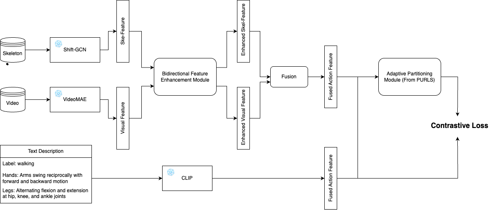

# Zero-shot Action Recognition for VR Senario

## Preprocess

### Slice Video and Skeleton
Slice ``mp4`` file and ``csv`` file. 
Original name format: ``{id}_{game name}_{camera}.mp4`` and ``{id}_{game name}.csv``.
Preprocess scripts: ``-`` and ``slice_all_video.py``
Output name format: ``01_boss_C_Bending Down_row9_rep1.mp4``  and ``csv_01_boss_C_row1_rep1_Walking.csv``

### Rename all Files
Format: S001C001P001R001A001L001
Scripts: ``transfer.py`` and ``transfer_v.py``

|  | S | C | P | R | A | L |
|------|------|------|------|------|------|------|
|  **Meaning**  | Setting   | Camera ID   | Person ID  | Repetition   | Action  | Line |

(Future improvement: Line and Repetion can be unified)

**Action Defnition**

| ID | Action                      | Description                          |
|----|------------------------------|--------------------------------------|
| 0  | walking                      | Walk forward at a natural pace       |
| 1  | running                      | Run at a steady speed                |
| 2  | jumping                      | Jump upward from the ground          |
| 3  | bending down                 | Bend torso downward                  |
| 4  | stand                        | Stand upright                        |
| 5  | squatting                    | Lower body into squat position       |
| 6  | raising hand                 | Raise one hand upward                |
|----|------------------------------|--------------------------------------|
| 7  | waive                        | Wave hand side to side               |
| 8  | throw                        | Throw an object forward              |
| 9  | cut                          | Perform a cutting motion             |
| 10 | shooting                     | Mimic shooting with hands or object  |
| 11 | bowling                      | Perform bowling motion               |
| 12 | move using controller        | Move character with VR controller    |
| 13 | waive sword                  | Swing sword in waving motion         |
| 14 | measure length               | Gesture measuring length with hands  |
| 15 | picking up an item from table| Pick up an item from a table         |
| 16 | throwing a net to catch fish | Throw a net in a casting motion      |
| 17 | grab and collect box         | Grab and collect a box               |

### Current Issues
Current issues: Some file names were inconsistent during recording, and there are also spelling errors in the file names. The Excel formats used are not uniform, and in some cases, extra spaces were added after the action names.

## Feature Extraction for Zero-shot Action Recognition

### Workflow

Prepration: Complie Shift-GCN CUDA extensions, reference [https://github.com/kchengiva/Shift-GCN/](here).

Step 0: Split labels into seen/unseen/val sets: ``hku_skeleton_25/label_splits/gen_splits.py``

Step 1: Skeleton data normalizion (need to set path): ``Feature Extraction/GCN-VideoMAE/data_gen/hku_gendata.py``

Step 2: Set configs for generation: ``Feature Extraction/GCN-VideoMAE/config/hku/hku_gen.yaml``

Step 3: Generate: ``bash gen_hku.sh``

## Zero-shot Action Recognition

### Preparation

Step 1: Create descriptions for each body part ``Model/supplements/call_llm.py``

Step 2: Check descriptions in ``xlsx`` file, generate data for traning. ``Model/supplements/process.py``

### Model

### Experiments

| ID        | Experiment Setting                                                                 |
|-----------|-------------------------------------------------------------------------------------|
| Baseline  | [PURLS](https://arxiv.org/pdf/2406.13327)                                                                              |
| 1         | Bidirectional cross-attention |
| 2         | Add a bias when using visual feature as query            |
| 3         | Add a bias when using skeleton feature as query           |
| 4         | Add biases for all features           |
| 5         | Only use skeleton feature         |
| 6         | Symmetric gated co-attention |

| ID        | Overall Accuracy (%) | Not-Weighted Accuracy (%) |
|-----------|-----------------------|---------------------------|
| Baseline  |              16.1         |          21.2                 |
| 1         |              76.1         |           64.6                |
| 2         |              65.0         |           35.8                |
| 3         |               40.0        |            35.2               |
| 4         |              62.0         |            36.0               |
| 5         |              54.4         |             44.3              |
| 6         |            63.5           |               50.6            |
